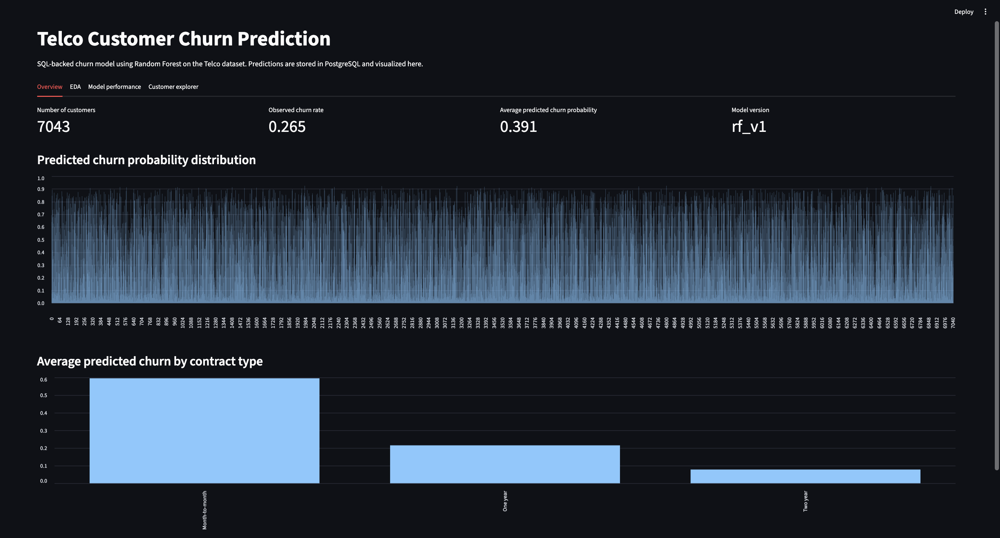
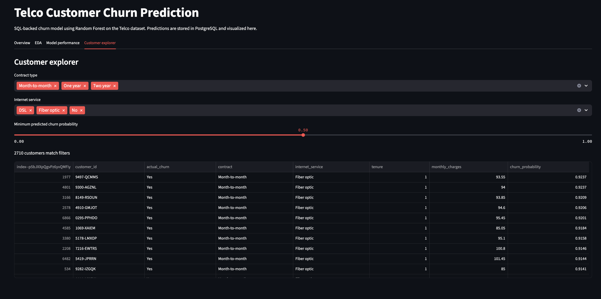

# Telco Customer Churn Prediction

End to end customer churn project using

- PostgreSQL for data storage  
- SQL for schema and queries  
- Python and scikit-learn for modeling  
- Streamlit for an interactive dashboard

The goal is to predict which telco customers are most likely to churn so that a business can target retention efforts.

---

## Tech stack

- Python 3.11+  
- PostgreSQL  
- SQLAlchemy  
- scikit-learn  
- pandas, numpy, matplotlib, seaborn  
- Streamlit

---

## Project architecture

Data and model flow:

1. **Raw data**  
   The Telco Customer Churn dataset is downloaded from Kaggle:  
   https://www.kaggle.com/datasets/blastchar/telco-customer-churn  

2. **Load to SQL**  
   `src/load_data_to_sql.py`  
   - Reads the CSV  
   - Cleans column names and numeric fields  
   - Creates the `customers` table with `sql/create_customers.sql`  
   - Inserts all customers into PostgreSQL

3. **Model training and predictions**  
   `src/train_model.py`  
   - Reads the `customers` table from PostgreSQL  
   - Builds a scikit-learn pipeline with:
     - OneHotEncoder for categorical features  
     - RandomForestClassifier for classification  
   - Trains the model on a train or test split  
   - Evaluates with ROC AUC and classification report  
   - Predicts churn probabilities for all customers  
   - Writes predictions into `churn_predictions` using `sql/create_churn_predictions.sql`

4. **Interactive dashboard**  
   `src/dashboard/streamlit_app.py`  
   - Reads the latest predictions from PostgreSQL  
   - Shows:
     - Overview metrics  
     - EDA views (churn by contract, internet service, tenure)  
     - Model performance (AUC, confusion matrix, threshold tuning)  
     - Customer explorer with filters for contract, internet type and probability threshold  

This mimics a small production style churn pipeline: SQL backed data, batch model scoring, and a simple front end.

---

## Model performance

On the Kaggle Telco churn dataset:

- ROC AUC: about **0.89**  
- At a threshold around **0.45**:
  - Churn recall: about **0.87**  
  - Churn precision: about **0.56**  
  - Weighted F1: about **0.79**

Interpretation:

- The model captures most true churners while accepting some false positives, which is usually the right trade off for retention use cases.

---


## Dashboard Preview

Because this project depends on a **local PostgreSQL instance**, the full dashboard cannot run directly on Streamlit Cloud.  
To make the project accessible to reviewers, several screenshots are included:

### **Model Overview**


### **Performance Metrics**


### **Confusion Matrix + Report**


### **Customer Explorer**


These images show the UI and outputs exactly as they appear when running the dashboard locally.

---

## Running Locally

This project requires:

- Local PostgreSQL (with a database named `churn_db`)
- A `.env` or configured connection string inside `utils/db.py`

Because Streamlit Cloud cannot connect to local databases, the dashboard must be run on your own machine.

If you want to run it yourself:

```bash
pip install -r requirements.txt
streamlit run src/dashboard/streamlit_app.py